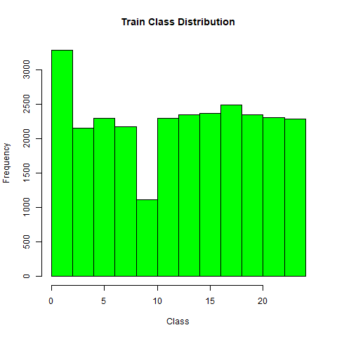
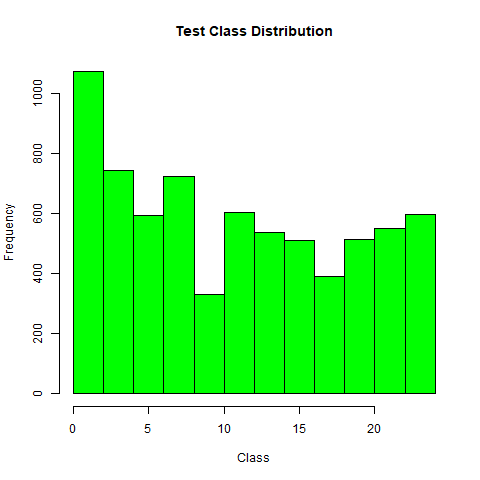
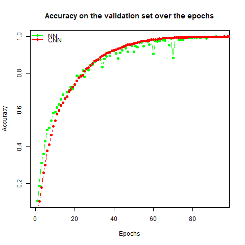

# **Gestures Language Classification**
## **Descizione del problema**
Si vuole progettare una rete neurale che data in input un immagine che raffigura una lettera del linguaggio dei segni, sia in grado di restituire in output il carattere alfabetico corrispondente. 

La comprensione e l'utilizzo del linguaggio dei segni richiedono un'apposita formazione e molti non udenti trovano difficile comunicare con le persone udenti che non conoscono il linguaggio dei segni.

Una rete neurale in grado di convertire il testo in linguaggio dei segni potrebbe quindi semplificare la comunicazione tra queste due popolazioni, migliorando la loro interazione e aumentando l'accessibilità alle informazioni per le persone non udenti.  

## **Dati Utilizzati**
Il dataset utilizzato è stato estratto da https://www.kaggle.com/datasets/datamunge/sign-language-mnist.

Questo pannello rappresenta un campione di immaggini realmente scattate alle persone

Quest'altro pannello raffigura le immagini campionate e in scala di grigi usate per addestrare il modello.

In totale abbiamo 27455 immagini nel Training Set, e 7172 immagini nel Test Set.

Tecnicamente il Training Set è una matrice 27455 X 785.
Nella prima colonna ci sta l'etichetta, mentre nelle retanti 784 si hanno i valori dei pixels. 
Il Test Set è una matrice 7172 X 785.

La distribuzione delle classi nel Training Set è abbastanza uniforme. Questo ci permette di usare l'accuracy come metrica di valutazione con un livello di confidennza ragionevole.

## **Risultati**
Il seguente grafico mostra l'accuracy delle due reti sul validation set :

Simple Neural Network's accuracy on Test Set: **0.7766314** , circa il **77.7%**.

Convolutional Neural Network's accuracy on Test Set: **0.8633575** , circa l' **86.3%**.

In definitiva posiamo concludere che la CNN classifica meglio le immagini del linguaggio dei segni, rispetto alla rete non convoluzionale.